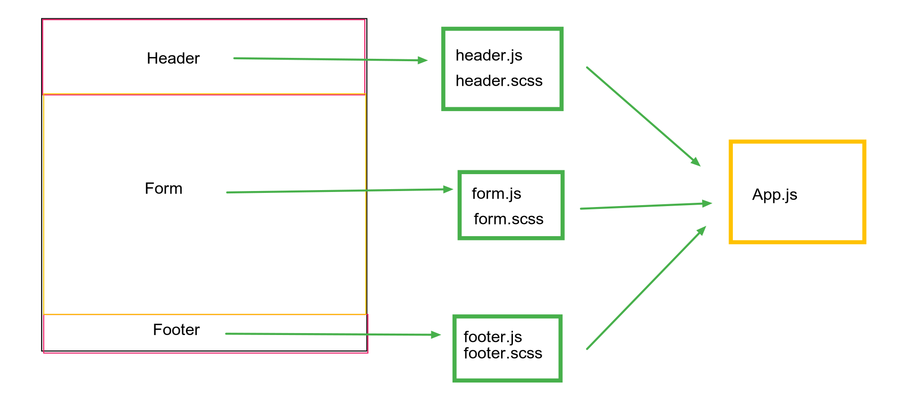

# LAB: RESTy
Our application will be an API testing tool that can be run in any browser, allowing a user to easily interact with     APIs in a familiar interface.
- A browser based API testing tool

### Author: Raghad Al-Quran

### Links and Resources

- [submission PR branch: base](https://github.com/401-advanced-javascript-raghad/resty/pull/1)
- [submission PR branch: testing](https://github.com/401-advanced-javascript-raghad/resty/pull/3)

#### How to initialize/run your application
- `npm run start`

#### UML
